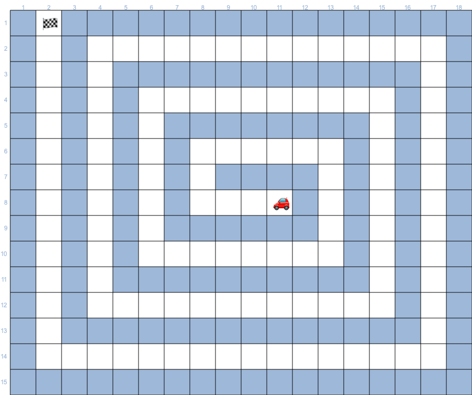
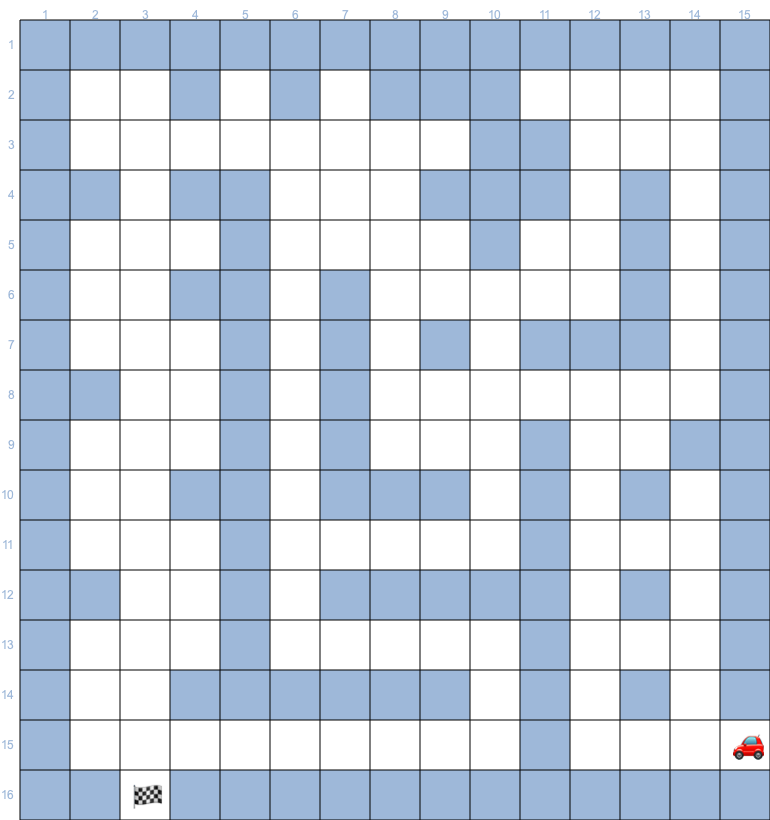

# Basics Redux

In this assignment your goal is always to get the car to the final flag. 
You have four functions (Lego blocks) to achieve this:

- **Move** : Moves the car 1 space in the direction it is heading. 
- **Turn** : Turns the car 90 deg clockwise. 
- **Peek** : Returns true if the next cell is open, otherwise false. 
- **AtGoal:** : Retruns true if the current cell is the goal cell.

Of course, you also have the option to use the other blocks that you create based on our syllabus to achieve your goal (variables, conditionals, arrays, loops and functions)

Remember that the functions may have a diffrent writing style depending on your choosen language, this is because of conventions in the given langauge.
Use the convention that is correct for your language. 

***Example:***  
  
Possible  solution
```csharp
Move();
Move();
Move();
Turn();
Move();
Move();
Turn();
Turn();
Turn();
Move();
```

This is a labor-intensive way of creating the program, possible for small problems like this example, but exhaustive for the tasks ahead. So, dive into the toolbox (variables, conditionals, arrays, loops and functions).

## Evaluation

The score is calculated using the following score key:  

- 25% Does your code solve the task?
- 30% How well do you use programming concepts?
- 15% Readability, how easy is your code to follow?
- 15% Complexity/Verbosity, how complex is your code? 

Additionaly these dimentions are considerd either or: 

- 5% Code conventions, how well does your code follow a code convention?
- 5% Did you use git sensably?  
- 5% Profesionality 

## Submission 

URL to **PUBLIC** Github repository that contains only the files listed in the task descriptions.  
We have included template files that can be used to scaffold these files.  
**We expect to se one commit per file, with meaningfull commit message.**

### About file names when submitting.
If a task spescefies for instance task1.* you replace the * with the file ending for your language.
I.e. if you are wrting in c# the ending becomes cs so task1.cs, if you are wrting in js than the file becomes task1.js or task1.mjs, if you are writing in Python it becomes task1.py


## Task 1

As stated you can use the functions Move, Turn, Peek and AtGoal + variables, conditionals, arrays, loops and functions to get the car to the end.

**Submit**:   
Add task1.* file to the repo.  
Commit to github. 

  

## Task 2

As stated you can use the functions Move, Turn, Peek and AtGoal + variables, conditionals, arrays, loops and functions to get the car to the end.

**Submit**:   
Add task2.* to the repo.  
Commit to github. 

  

## Task 3

As stated you can use the functions Move, Turn, Peek and AtGoal + variables, conditionals, arrays, loops and functions to get the car to the end.

**Submit**:   
Add task3.* to the repo.  
Commit to github. 

 

## Task 4

As stated you can use the functions Move, Turn, Peek and AtGoal + variables, conditionals, arrays, loops and functions to get the car to the end.

**Submit**:   
Add task4.* to the repo.  
Commit to github. 

 

## Task 5

As stated you can use the functions Move, Turn, Peek and AtGoal + variables, conditionals, arrays, loops and functions to get the car to the end.

**Submit**:   
Add task5.* to the repo.  
Commit to github. 

 